# Project: Study the effectiveness of technical analysis indicator in Cryptocurrencies
- :star2: **Found this repository helpful?** Light it up with a star :star2: and make my day! :wink:

Data:
Use ccxt package https://github.com/ccxt/ccxt in python to download two type of cryptocurrencies (‘BTC/USDT’ and ‘ETH/USDT’) bar data (daily, hourly) from Binance exchange.

- Daily data: as far as possible - 2023.03.16 
- Hourly data: 2021.01.01 - 2023.03.16


- Aim: Apply two types of technical indicators (EMA and MACD), carry out research on the effectiveness of these two indicators:
  - Research on different parameters setting on EMA
  - Research on different parameters setting on MACD
  - Propose a set of suitable parameters to trade daily data
  - Propose a set of suitable parameters to trade hourly data

- Step: 
  1. Data processing
  2. Performance analysis at different parameter (average return per trade, accumulated
     return, win ratio, max win/loss percentage)
  3. Propose a set of suitable parameters, analysis the reason
  4. Analysis and comparison between EMA and MACD signal performance


## 1. Data processing
### 1.1 Fetch data from Binance in Python using CCXT
- The historical data data of Bitcoin (BTC) and Ethereum (ETH) is fetched from Binance exchange using the CCXT library. The function named fetch_data(ex, sym, dt, start, end) is used for fetching data, and the output is DataFrame. The data is retrieved in two timeframes: daily and hourly. The data contains the columns for date, time, cryptocurrency symbol, opening price, high, low, closing price, and volume. Finally, the daily and hourly data is saved in two separate CSV files for further processing.
- This data provides a starting point for further analysis and research on cryptocurrency trading strategies, particularly using technical indicators like EMA and MACD. The fetched data can be further analyzed to test different parameter settings for these indicators and their effectiveness in trading cryptocurrency.

| Timeframe   | Start                                    | End                 |
|-------------|------------------------------------------|---------------------|
| Daily data  | 2017-08-17                               | 2023-03-16          |
| Hourly data | 2021-01-01 08:00:00 (as far as possible) | 2023-03-16 23:00:00 |

### 1.2 Further data processing in Q(kdb)
#### 1.2.1. Define the functions EMA and MACD.
- EMA – Exponential Moving Average
$$ 𝐸𝑀𝐴(𝑛)= \frac{2}{1+n} 𝑃(𝑡)+(1-\frac{2}{1+n})𝐸𝑀𝐴(𝑡−1) $$

- MACD - Moving Average Convergence Divergence 
  - MACD(i, j, k) = DIF - SIG
  - DIF = EMA(Price, i) - EMA(Price, j) 
  - SIG = EMA(DIF, k)


#### 1.2.2 Define function cross_signal_bench to calculate return and duration. signal might be (emaS-emaL) or macd to backtest
- First, based on signal, signalprev, update side.
  - 𝑏𝑢𝑦: 𝑠𝑖𝑑𝑒 = 1 𝑖𝑓 𝑠𝑖𝑔𝑛𝑎𝑙 ≥ 0, 𝑠𝑖𝑔𝑛𝑎𝑙𝑝𝑟𝑒𝑣 < 0
  - 𝑠𝑒𝑙𝑙: 𝑠𝑖𝑑𝑒 = −1 𝑖𝑓 𝑠𝑖𝑔𝑛𝑎𝑙 < 0, 𝑠𝑖𝑔𝑛𝑎𝑙𝑝𝑟𝑒𝑣 >= 0

- Then, calculate the return of each trade where side ≠ 0. I choose close price and next close price as the enter price and exit price.
$$ 𝑅𝑒𝑡𝑢𝑟𝑛 = (−1 + \frac{𝐸𝑥𝑖𝑡 𝑃𝑟𝑖𝑐𝑒}{𝐸𝑛𝑡𝑒𝑟 𝑃𝑟𝑖𝑐𝑒} ) × 𝑠𝑖𝑑𝑒  $$

```sql
cross_signal:{[m]
    m: update signalside:?[signal>0;1i;-1i], j:sums 1^i - prev i by sym from m; 
    m: update signalidx:fills ?[0= deltas signalside;0N;j] by sym from m;
    update n:sums abs signalside, signaltime:first time, signalprice:first close by sym,signalidx from m
    };
cross_signal_bench:{[m]
    r: select from cross_signal[m] where n=1, 1 = abs signalside ; 
    r: r upsert 0!select by sym from m; //add last row per symbol
    r: update bps:10000*signalside*-1+pxexit%pxenter, nholds:(next j)-j by sym from update pxexit:next pxenter by sym from `sym`time xasc r; delete from r where null signalside
    };
```

#### 1.2.3 Define function ema_cross_over:{[data; ival; jval] and macd_cross_over:{[data; ival; jval; kval].
- The input is parameter for emaS, emaL, macd and then call function cross_signal_bench . Get the return rtn of each trade, and then calculate average return per trade, accumulated return, win ratio and max win/loss percentage by side and sym
  - Return of each trade: rtn
  - Average return per trade: avg rtn Accumulated return: sum rtn
  - Duration: avg nholds
  - Win ratio: (count i where rtn>0)%count i 
  - Max win/loss percentage: max rtn / min rtn

## 2. Performance analysis at different parameter
- In this section, traverse commonly used parameters for EMA and MACD by using raze and while loop. Backtest historical data. Compare their performance.
### 2.1 EMA(i, j)
- Iiterate over the i range from 1 to 90 with a step size of 3, and iterate the j from 1 to 180 with a step size of 3, such that the short moving average is less than the long moving average.
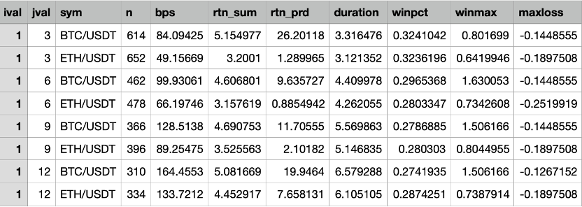

### 2.2 MACD(i, j, k)
- Iterate over MACD(I, j , k) where the i range from 5 to 14 with a step size of 1, j range from 20 to 30 with a step size of 1, and k range from 5 to 11 with a step size of 1.
  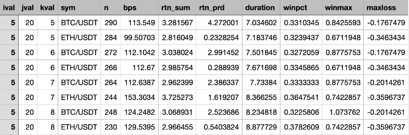

## 3. Fine Tune and Get Optimal Parameter Set
- In the previous section, I went over commonly used parameters for backtesting EMA and MACD. In this section, I will evaluate the performance of different parameter sets, from these perspectives average return per trade, accumulated return, win ratio, max win/loss percentage.
- In this section, I create a scoring function that takes into account these five attributes:
  -	Average Return per Trade (ARPT)
  -	Accumulated Return (AR)
  -	Win Ratio (WR)
  -	Maximum Win Percentage (MWP)
  -	Maximum Loss Percentage (MLP)

- Then, I define a scoring function (S) that combines these metrics with certain weights (w1, w2, w3, w4, w5) reflecting the importance of each metric for a different risk tolerance investor. These weights can be adjusted according to investor’s preferences and investment goals.
  -	Score = w1 * ARPT + w2 * AR + w3 * WR + w4 * MWP - w5 * MLP

- For a **high-risk tolerance** investor, I assign higher weights to MWP and ARPT, and lower weights to MLP. For example:
  -	w1 = 0.3
  -	w2 = 0.2
  -	w3 = 0.1
  -	w4 = 0.3
  -	w5 = 0.1
  -	score_hr = 0.3 * ARPT + 0.2 * AR + 0.1 * WR + 0.3 * MWP + 0.1 * MLP

- For a **low-risk tolerance** investor, I assign weights that prioritize lower maximum loss percentage and higher win ratio, while giving less importance to maximum win percentage and average return per trade. For example:
  -	w1 = 0.1
  -	w2 = 0.1
  -	w3 = 0.4
  -	w4 = 0.1
  -	w5 = 0.3
  - score_lr = 0.1 * ARPT + 0.1 * AR + 0.4 * WR + 0.1 * MWP + 0.3 * MLP

### 3.1 Add score metric
- I calculate the score for high-risk tolerance investor score_hr and score for low-risk tolerance investor score_lr for four tables ema_daily_res, ema_ hourly _res, macd_ daily _res and macd _hourly_res.
  -  EMA
  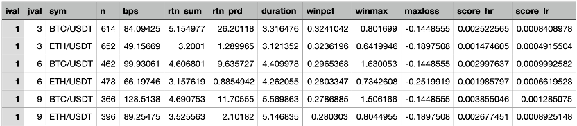
  -  MACD
  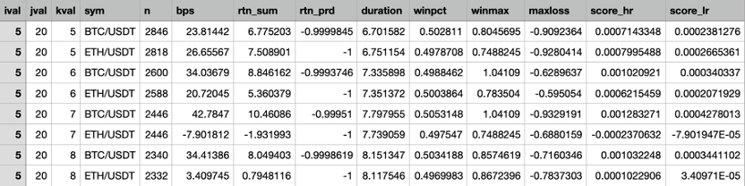

### 3.2 Performance Evaluation
- I try to identify the optimal parameter set that result in the highest score_hr and score_lr values for each sym in the given tables.

#### 3.2.1 EMA
- I find the maximum score_hr and score_lr for each sym in both tables using fby sym clause. The results are saved in four separate tables hr_ema_daily, lr_ema_daily, hr_ema_hourly, and lr_ema_hourly, which contain the ival, jval, sym, and the corresponding maximum score_hr or score_lr value.

- For **high-risk tolerance investor**:
  - hr_ema_daily
    - 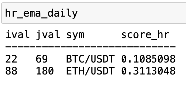

  - hr_ema_hourly
    - 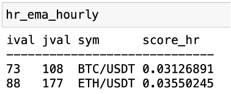
  
- For **low-risk tolerance investor**: 
  - hr_ema_daily
    - 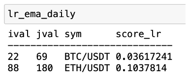
  - hr_ema_hourly
    - 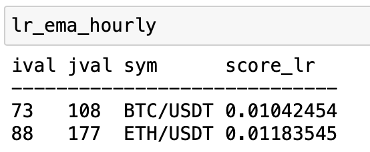
- For both high-risk tolerance investor and low-risk tolerance investor, the optimal parameter set is [22, 69] for BTC daily data, [88, 180] for ETH daily data, [22, 69] for BTC hourly data and [88, 180] for ETH hourly data. 

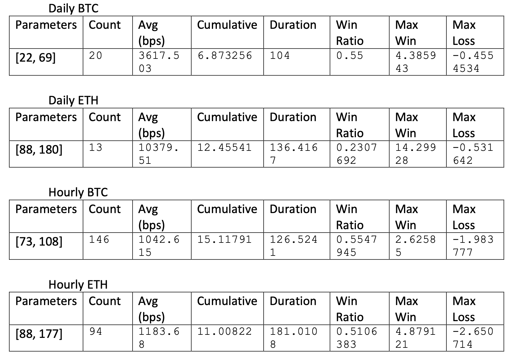


#### 3.2.2 MACD

- I find the maximum score_hr and score_lr for each sym in both tables using fby sym clause. The results are saved in four separate tables hr_macd_daily, lr_macd_daily, hr_macd_hourly, and lr_macd_hourly, which contain the ival, jval, kval, sym, and the corresponding maximum score_hr or score_lr value.
- For **high-risk tolerance investor**:
  - hr_macd_daily
    - 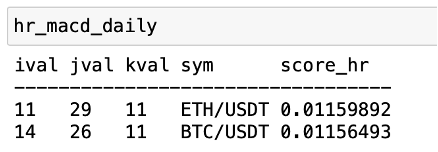

  - hr_macd_hourly
    - 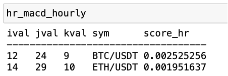

- For **low-risk tolerance investor**:
  - hr_macd_daily
    - 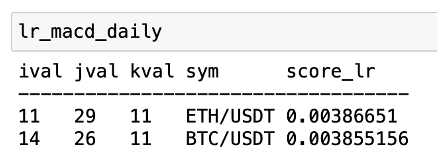
  - hr_macd_hourly
    - 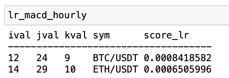

- For both high-risk tolerance investor and low-risk tolerance investor, the optimal parameter set is [14, 26, 11] for BTC daily data, [11, 29, 11] for ETH daily data, [14, 26, 11] for BTC hourly data and [11, 29, 11] for ETH hourly data.
  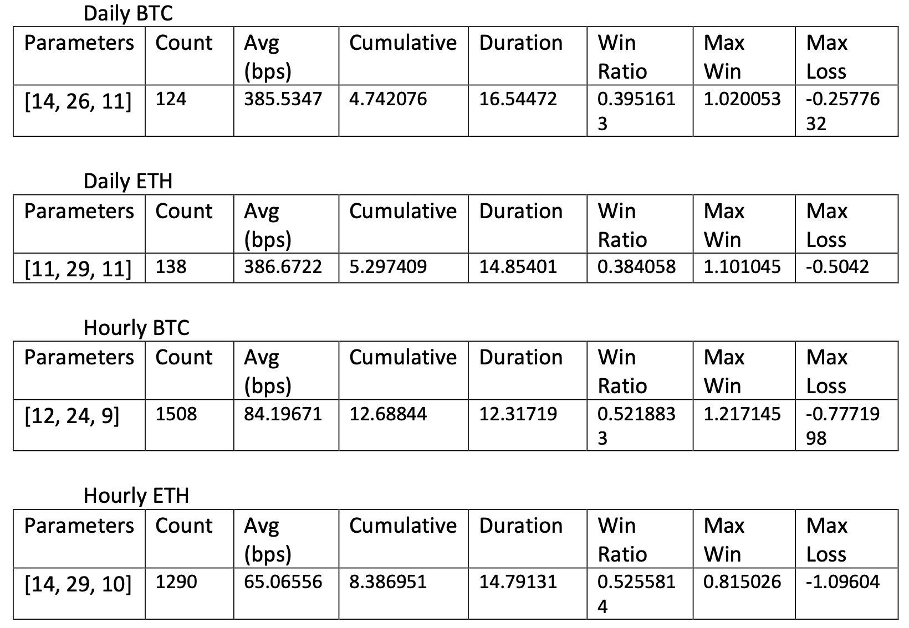

### 3.3 Optimal Parameter Sets

|     |        | EMA       | MACD         |
|-----|--------|-----------|--------------|
| BTC | Daily  | [22, 69]  | [14, 26, 11] |
| ETH | Daily  | [88, 180] | [11, 29, 11] |
| BTC | Hourly | [73, 108] | [12, 24, 9]  |
| ETH | Hourly | [88, 177] | [14, 29, 10] |

## 4. Indicator Comparison 
### 4.1 Performance Analysis
- Benchmark: buy and hold

|            | Cumulative |
|------------|------------|
| Daily BTC  | 4.833912   |
| Daily ETH  | 4.542152   |
| Hourly BTC | -0.1416338 |
| Hourly ETH | 1.265533   |

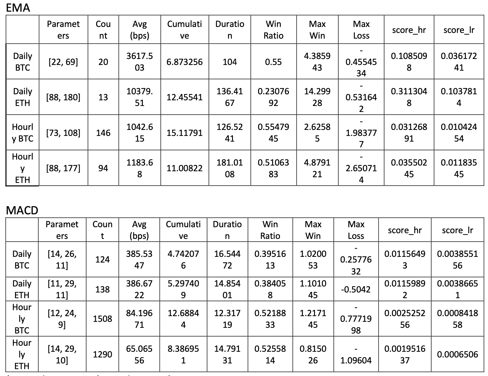
- (Note that score_hr and score_lr.
  -	Average Return per Trade (ARPT)
  -	Accumulated Return (AR)
  -	Win Ratio (WR)
  -	Maximum Win Percentage (MWP)
  -	Maximum Loss Percentage (MLP)
  -	**score_hr** = 0.3 * ARPT + 0.2 * AR + 0.1 * WR + 0.3 * MWP + 0.1 * MLP
  - **score_lr** = 0.1 * ARPT + 0.1 * AR + 0.4 * WR + 0.1 * MWP + 0.3 * MLP )

### 4.2 High/Low-Risk Tolerance Investor Score

- The score_hr and score_lr metrics are calculated based on the weights assigned to different performance measures for high-risk and low-risk tolerance investors. These scores provide a single value to evaluate the overall performance of a strategy, taking into account different investor preferences.

- EMA has higher scores for both BTC and ETH in daily trading (0.11 vs 0.01 and 0.31 vs 0.01) and hourly trading (0.03 vs 0.0025 and 0.036 vs 0.0020).
- This indicates that EMA is more suitable for high-risk tolerance investors, as it performs better in terms of average return per trade, accumulated return, win ratio, maximum win percentage, and maximum loss percentage.
- EMA also has higher scores for both BTC and ETH in daily trading (0.036 vs 0.004 and 0.10 vs 0.004) and hourly trading (0.01 vs 0.0008 and 0.01 vs 0.0006).
- This indicates that EMA is also more suitable for low-risk tolerance investors.
  
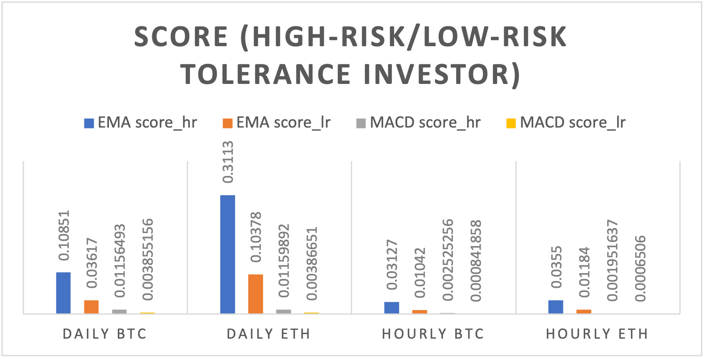
<center>Figure 1. Score (High-risk / low risk tolerance investor)</center>

### 4.3 Cumulative Return
- EMA has higher cumulative returns than MACD  and benchmark for both BTC and ETH in daily trading (6.87 vs 4.74 and 12.46 vs 5.30) and hourly trading (15.12 vs 12.69 and 11.01 vs 8.39).
- This indicates that EMA is more successful at generating higher returns over the entire backtesting period compared to MACD.
- For daily trading of BTC, EMA had a cumulative return of 6.87 while MACD had a cumulative return of 4.74. For daily trading of ETH, EMA had a cumulative return of 12.46 while MACD had a cumulative return of 5.30.
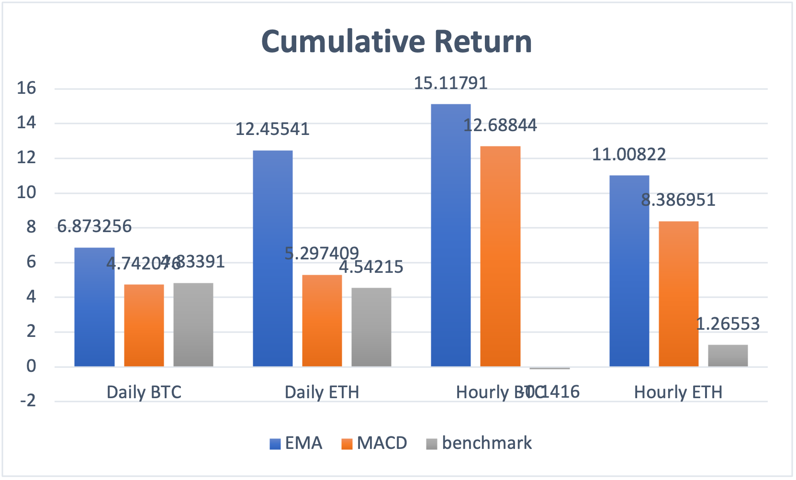
<center>Figure 2. Cumulative return</center>

### 4.4 Win Ratio:
- EMA has higher win ratios than MACD for BTC in daily and hourly trading (0.55 vs 0.40 and 0.55 vs 0.52). MACD has higher win ratios than EMA for ETH in daily and hourly trading (0.23 vs 0.38 and 0.51 vs 0.53).
- This indicates that EMA has a higher percentage of profitable trades compared to MACD.
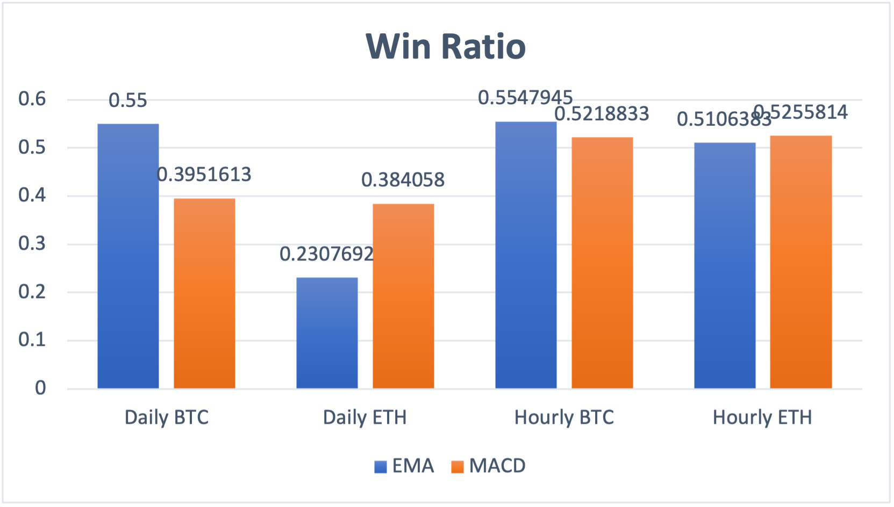
<center>Figure 3. Win ratio</center>

### 4.5 Duration
- Duration represents the average holding period for a trade. A shorter duration may indicate more frequent trading, while a longer duration may indicate less frequent trading. In general, shorter durations can result in higher transaction costs due to more frequent trading, while longer durations may expose the strategy to more market risks.
- EMA has a longer duration than MACD in daily trading of both BTC (104 vs 16.54) and ETH (136.42 vs 14.85).
- In hourly trading, EMA also has a longer duration for both BTC (126.52 vs 12.32) and ETH (181.01 vs 14.79).
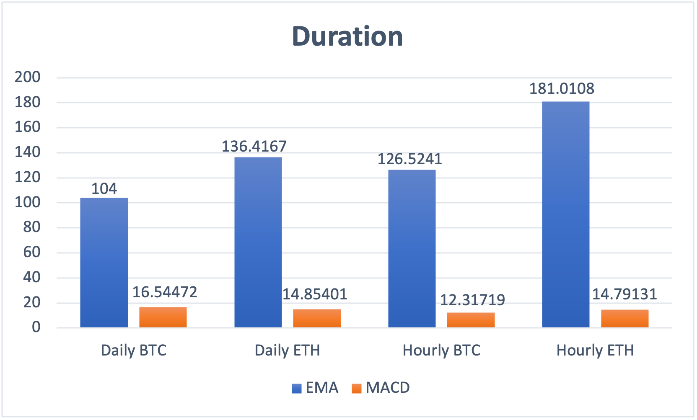
<center>Figure 4. Duration</center>


### 4.6 Average return
- The average return per trade indicates the average profit or loss per trade executed by the strategy.
- EMA has a higher average return per trade than MACD for daily trading of BTC (3617.503 bps vs 385.5347 bps) and ETH (10379.51 bps vs 386.6722 bps).
- EMA also has a higher average return per trade for hourly trading of BTC (1042.615 bps vs 84.19671 bps) and ETH (1183.68 bps vs 65.06556 bps).
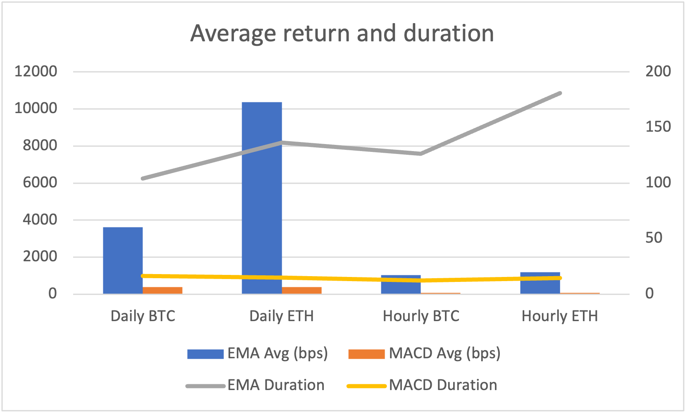
<center>Figure 5. Average return and duration</center>


### 4.7 Max Win Rate and Max Loss Rate
- These metrics indicate the highest winning and losing trades experienced by each strategy.
- EMA has a higher max win rate and a lower max loss rate for daily trading of BTC (4.39 vs 1.02 and -0.46 vs -0.26) and ETH (14.30 vs 1.10 and -0.53 vs -0.50).
- EMA has a higher max win rate and a lower max loss rate for hourly trading of BTC (2.63 vs 1.22 and -1.98 vs -0.78) and ETH (4.88 vs 0.82 and -2.65 vs -1.10)
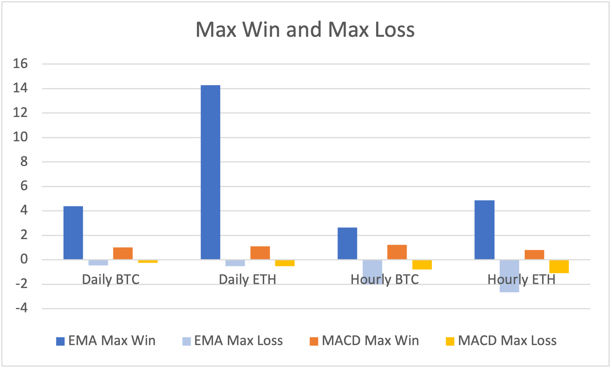
<center>Figure 6. Max win and max loss</center>


### 4.8 Analysis by year
- In the daily data, both EMA and MACD strategies for BTC and ETH generally have positive cumulative returns before 2021. However, starting in 2021, the performance of these strategies declines.
- The hourly data, which is only available from 2021, shows mixed results. Some strategies have positive cumulative returns, while others have negative cumulative returns. The performance of the hourly strategies is generally worse than the daily strategies before 2021. The decline in daily data performance since 2021 might be due to various factors, such as changes in market conditions, increased volatility, or the strategies becoming less effective due to changing market dynamics.
- As for the hourly data, it's possible that the strategies are less effective on an hourly timeframe compared to the daily timeframe due to factors such as increased noise, higher trading costs, or increased sensitivity to short-term price fluctuations. Additionally, the hourly strategies might be more affected by the declining market conditions since 2021, as they are more sensitive to short-term fluctuations.
- In conclusion, the decline in daily data performance since 2021, combined with the generally worse performance of the hourly strategies, suggests that the strategies might be less effective in the current market conditions.
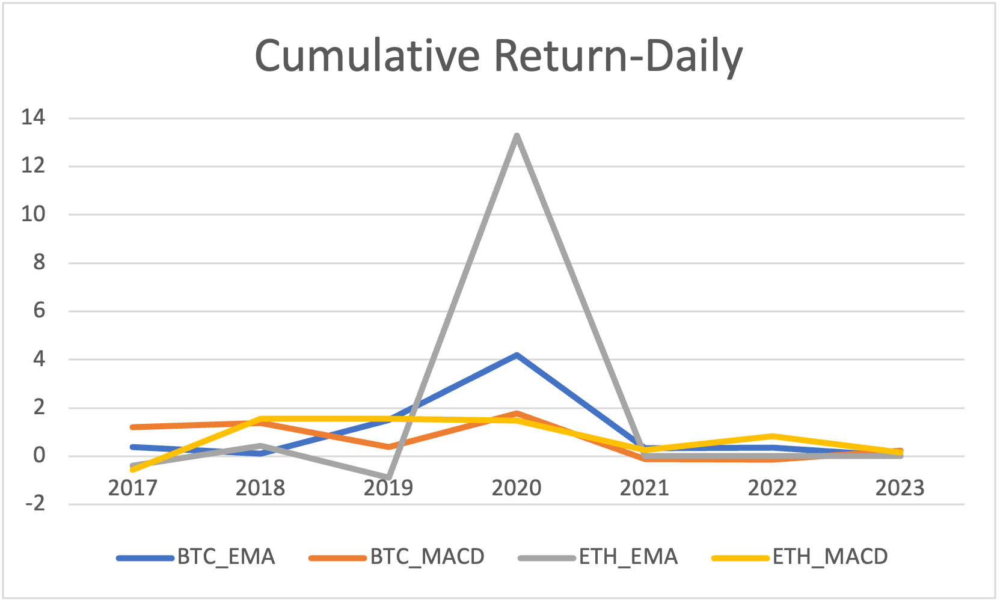
<center>Figure 7. Cumulative Return for daily data</center>

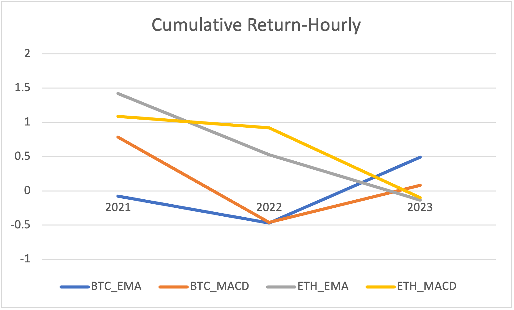
<center>Figure 8. Cumulative return for hourly data</center>

### 4.9 Analysis by side
- For daily data, both EMA and MACD strategies deliver higher returns on the long side (side: 1) compared to the short side (side: -1). The same trend is observed for hourly data, except for BTC-EMA, which shows a negative return on the short side. Overall, the long side seems to generate the majority of returns for both EMA and MACD strategies across Bitcoin and Ethereum.
  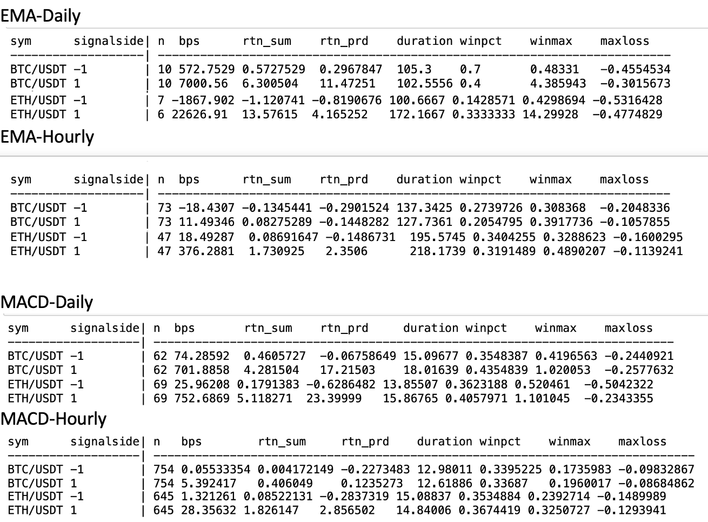

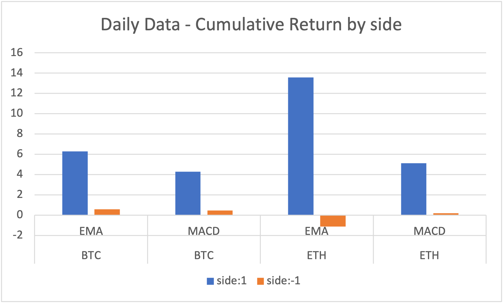
<center>Figure 9. Daily Data – Cumulative Return by side</center>

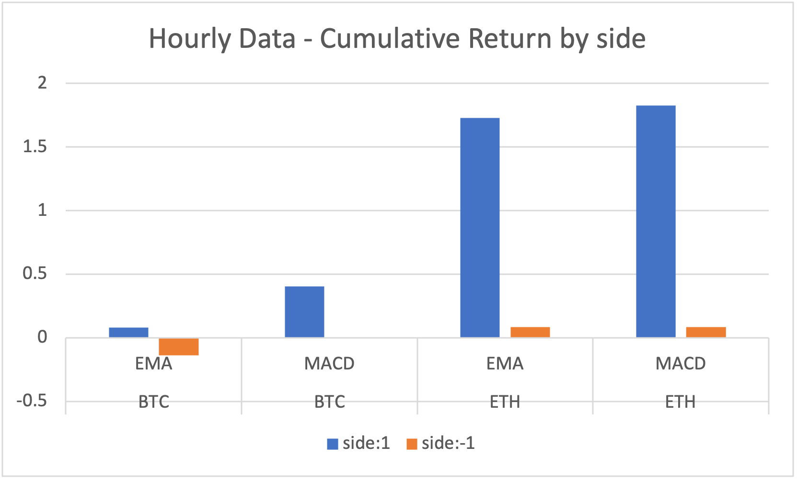
<center>Figure 10. Hourly Data – Cumulative Return by side</center>

## 5. Conclusion

- In this project, EMA and MACD technical indicators were tested on Bitcoin and Ethereum using a custom score function with adjustable weights for different risk tolerance levels. Optimal parameter sets were found by traversing common parameters and comparing performance between the two indicators.
- EMA outperformed MACD in both daily and hourly trading of Bitcoin and Ethereum, with better cumulative returns and win ratios. Although these strategies showed promising results, their effectiveness has declined since 2021, possibly due to changes in market conditions or increased volatility.
- Despite these results, it is crucial to guard against overfitting. To improve the analysis, consider testing the strategies on out-of-sample data to minimize overfitting and validate the strategies' effectiveness in different market conditions.

---
- :star2: **Found this repository helpful?** Light it up with a star :star2: and make my day! :wink:


